# NewsPulse

<p align="center">
  
</p>

<h3 align="center">Your Personalized News Experience</h3>

<p align="center">
  A modern Android news application designed to make discovering, reading, saving, and listening to news simple and engaging.
</p>

---

## About the Project

**NewsPulse** is a modern Android news application built to provide users with a personalized and immersive news-reading experience.

The application brings together news from different categories such as **Trending, Breaking, and Latest**, while allowing users to search, save, listen to, and personalize their news experience.

The app focuses on a clean interface, smooth interactions, personalization, and accessibility through features such as **dynamic font sizing, themes, saved articles, reading history, and text-to-audio**.

------
# Project Status

🚧 **Currently under development**

NewsPulse is an actively developed Android news application.
New features and improvements are being added as development continues.

------

## Features

### News Discovery

* Trending news
* Breaking news
* Latest news
* Category-based news browsing
* Personalized news interests
* Search for articles
* Explore screen with a mosaic-style layout

### Reading Experience

* Clean article detail screen
* Dynamic font size
* Multiple app themes
* Dark and light modes
* Immersive reading experience
* Smooth animations and transitions

### Save & History

* Save articles for later
* Double-tap to save an article
* Saved articles screen
* Reading history
* Offline access to saved content

### Text-to-Audio

* Convert news articles into audio
* Play articles like a podcast
* Audio playback controls
* Adjustable playback speed

### Personalization

* Choose preferred news interests
* Dynamic font-size slider
* Multiple visual themes
* Dark/Light mode
* Personalized reading experience

### User & Support

* Firebase authentication
* User profile
* Help & Support
* FAQ search
* Email support
* Telegram support
* Phone support

### Notifications

* Breaking/news notifications
* Notifications open the relevant article
* Personalized news updates

---
# Application Flow

<p align="center">
  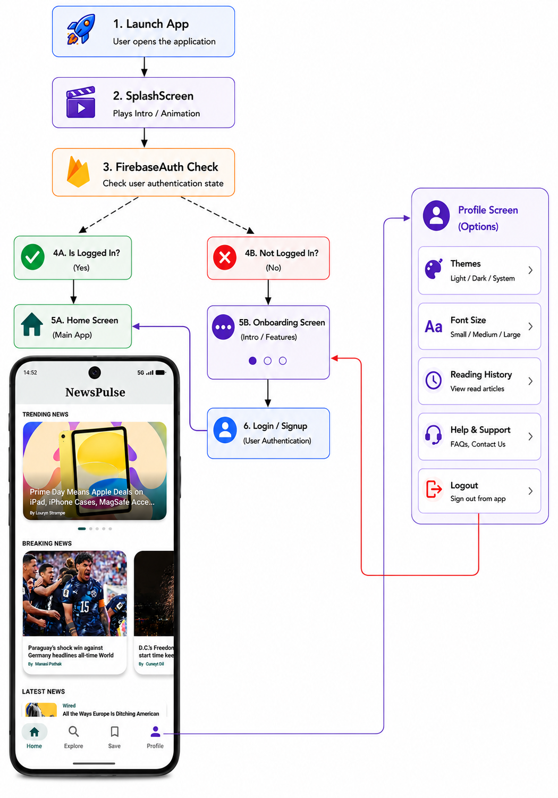
</p>


---

# Screenshots

### Onboarding & Authentication

<p align="center">
  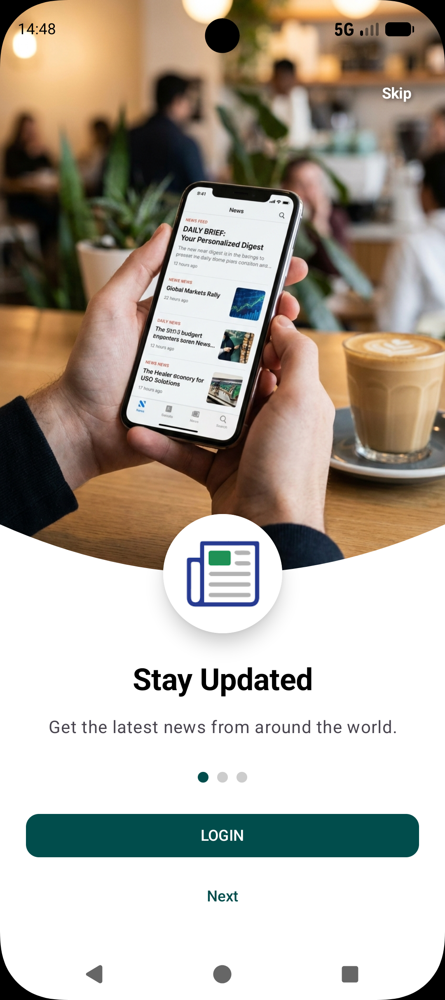
  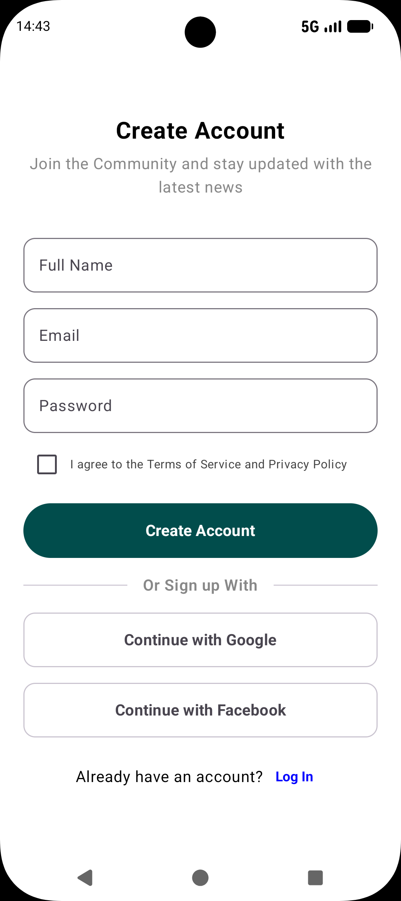
  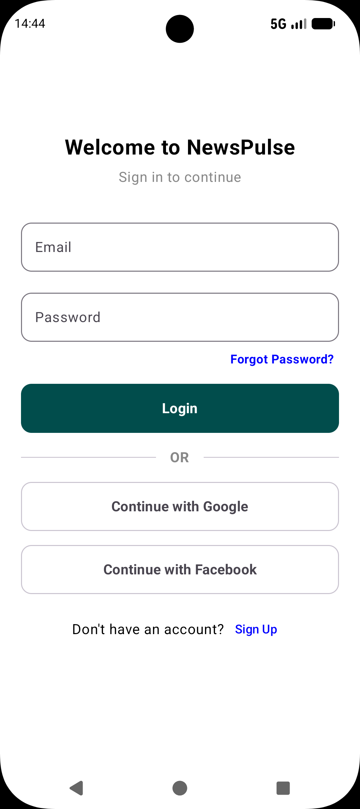
</p>

## Home

<p align="center">
  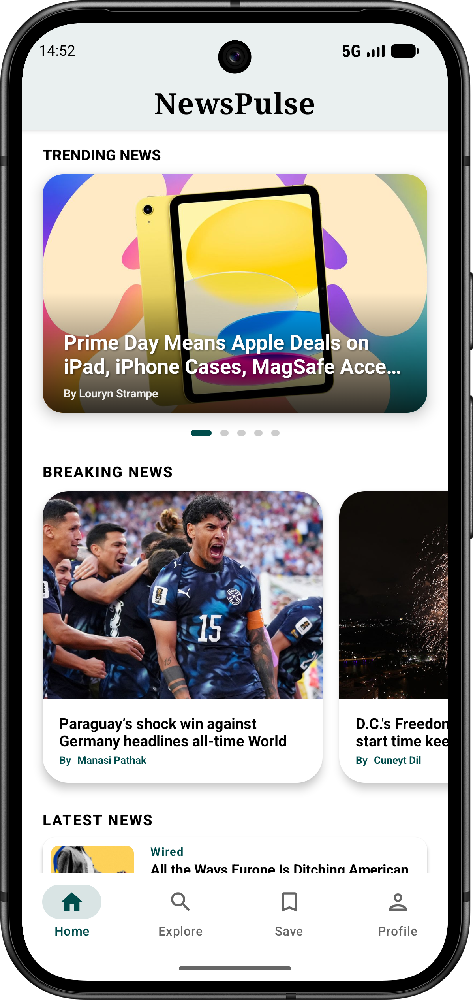
</p>

## Explore

<p align="center">
  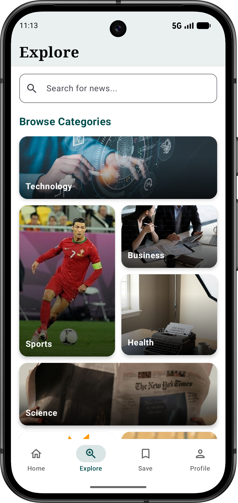
</p>

## Article

<p align="center">
  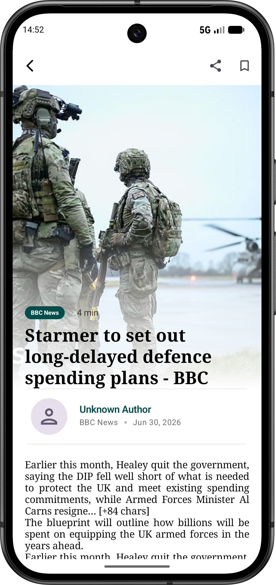
</p>

## Saved Articles

<p align="center">
  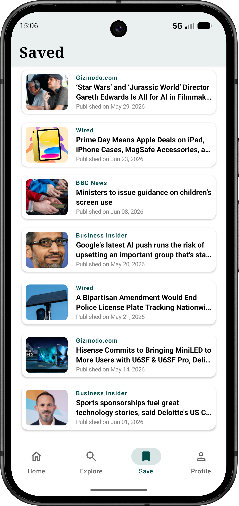
</p>

### Profile & Personalization

<p align="center">
  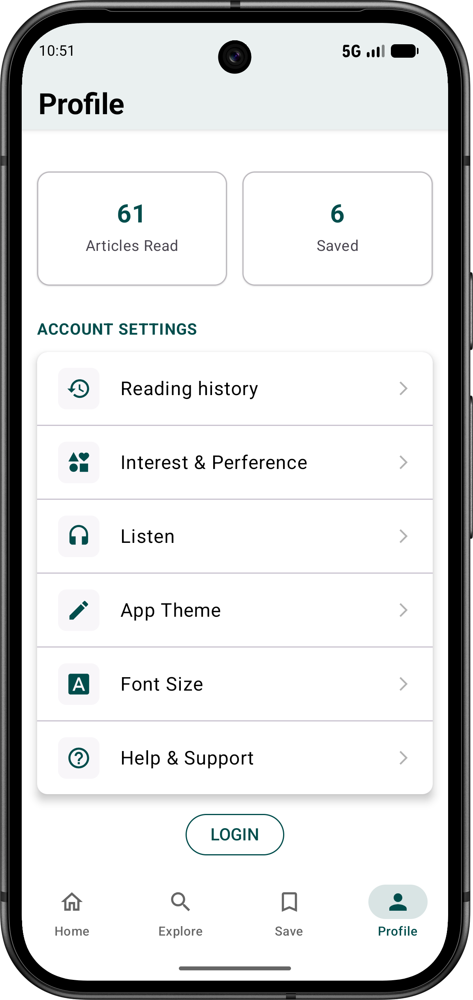
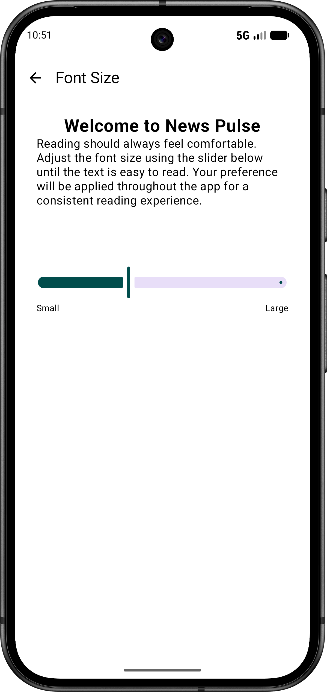
 
  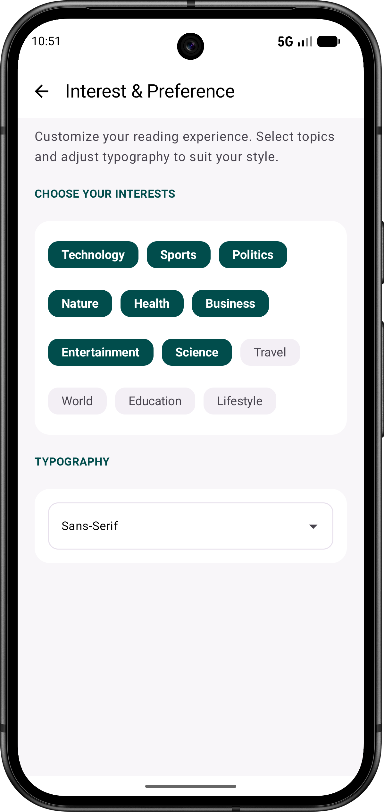
</p>

<p align="center">
  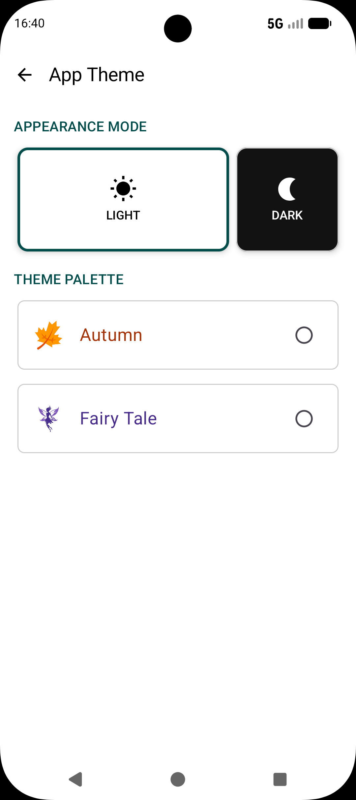
 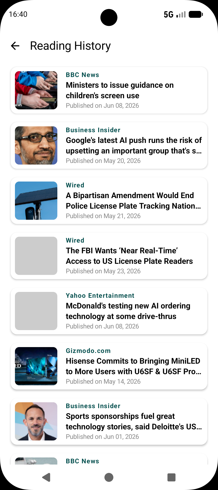
  
</p>

---
# Themes

Light Mode:

<p align="center">
  
</p>

Dark Mode:

<p align="center">
  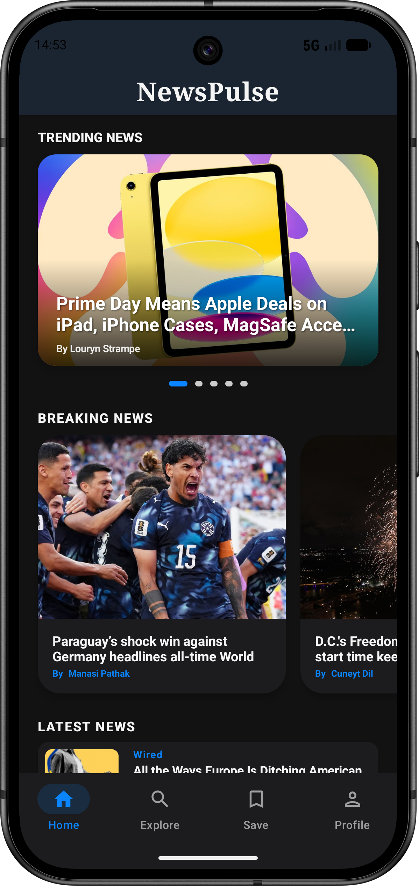
</p>

Autumn Mode:

<p align="center">
  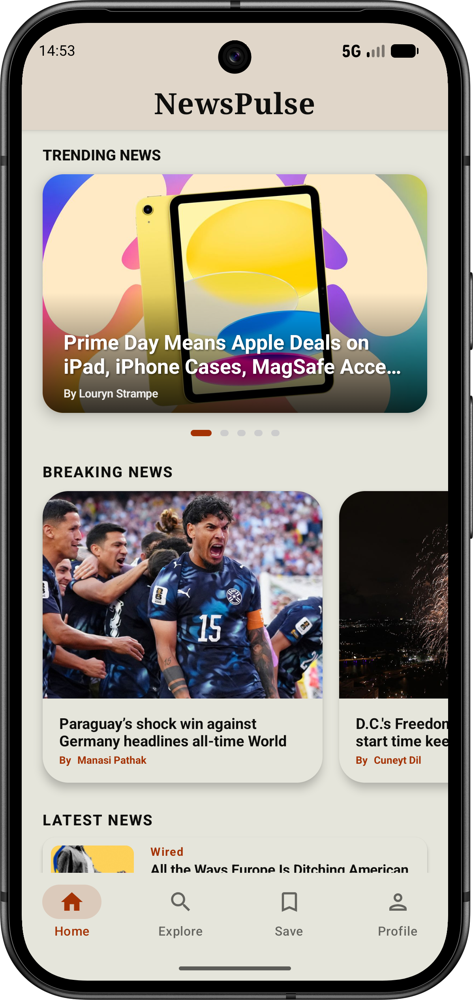
</p>

Fairy Mode:

<p align="center">
  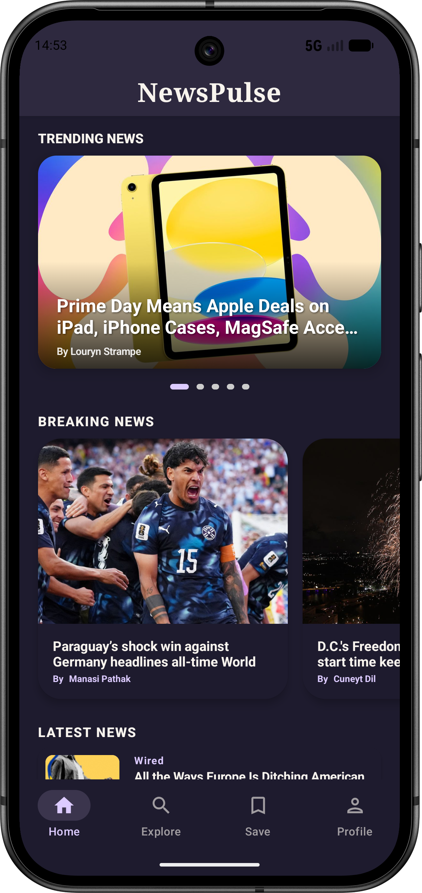
</p>


---

# Tech Stack

| Technology                   | Usage                                 |
| ---------------------------- | ------------------------------------- |
| **Kotlin**                   | Primary programming language          |
| **Jetpack Compose**          | UI development                        |
| **Material 3**               | UI components and design system       |
| **MVVM**                     | Application architecture              |
| **MVI**                      | State management for selected screens |
| **Navigation Compose**       | Screen navigation                     |
| **Retrofit**                 | REST API communication                |
| **Kotlin Coroutines**        | Asynchronous programming              |
| **Flow / StateFlow**         | Reactive state management             |
| **Room Database**            | Local data persistence                |
| **DataStore**                | User preferences                      |
| **Firebase Authentication**  | User authentication                   | 
| **Hilt**                     | Dependency injection                  |
| **Coil**                     | Image loading                         | 
| **Text-to-Speech**           | Article-to-audio functionality        |

---

# Architecture


The NewsPulse application primarily follows the **MVVM (Model–View–ViewModel)** architecture, ensuring a clean separation between the UI, business logic, and data layers.

For specific screens that require more complex UI state management, such as **Home, Explore, and Interest & Preference**, the **MVI (Model–View–Intent)** pattern is used to provide predictable state handling and a **unidirectional data flow**.

```text
                    ┌─────────────────────┐
                    │      UI Layer       │
                    │                     │
                    │   Jetpack Compose   │
                    │      Screens        │
                    │     Components      │
                    └──────────┬──────────┘
                               │
                               ▼
                    ┌─────────────────────┐
                    │   ViewModel Layer   │
                    │                     │
                    │      MVVM / MVI     │
                    │      UI State       │
                    │       Events        │
                    └──────────┬──────────┘
                               │
                               ▼
                    ┌─────────────────────┐
                    │  Repository Layer   │
                    │                     │
                    │   NewsRepository    │
                    │   Single Source     │
                    │     of Truth        │
                    └──────────┬──────────┘
                               │
                    ┌──────────┴──────────┐
                    ▼                     ▼
          ┌─────────────────┐   ┌─────────────────┐
          │   Remote Data   │   │    Local Data   │
          │                 │   │                 │
          │    Retrofit     │   │      Room       │
          │    News API     │   │    DataStore    │
          └─────────────────┘   └─────────────────┘
```


### Benefits

* **Separation of Concerns** – Clearly separates UI, business logic, and data responsibilities.
* **MVVM for Core Application** – Provides a structured and maintainable architecture across the main application.
* **MVI for Selected Screens** – Enables predictable state management for screens with complex interactions.
* **Scalability** – Makes it easier to add new features and screens as the application grows.
* **Maintainability** – Keeps application logic organized and easier to understand and modify.
* **Testability** – Separates business logic from UI components, making individual components easier to test.


<p align="center">
  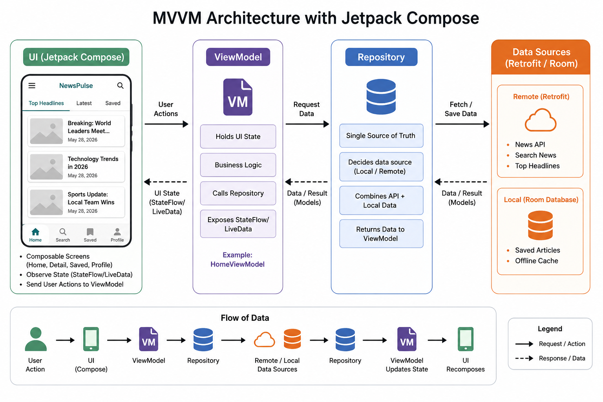
</p>
### Architecture Flow

```text
User Interaction
       ↓
Jetpack Compose UI
       ↓
ViewModel
       ↓
Repository
       ↓
Remote API / Local Database
       ↓
Repository
       ↓
StateFlow
       ↓
UI Update
```

---

# Project Structure

```text
app/
├── data/
│   ├── local/
│   ├── remote/
│   ├── model/
│   └── repository/
│
├── di/
│   └── AppModule.kt
│
├── navigation/
│   └── NavGraph.kt
│
├── ui/
│   ├── components/
│   ├── screens/
│   │   ├── home/
│   │   ├── explore/
│   │   ├── article/
│   │   ├── saved/
│   │   └── profile/
│   │
│   └── theme/
│
├── viewmodel/
│
└── MainActivity.kt
```

---

# API

NewsPulse uses a news API to retrieve current news articles.

The application communicates with the API using:

```text
Jetpack Compose
       ↓
ViewModel
       ↓
Repository
       ↓
Retrofit
       ↓
News API
```

---

 
# Key Highlights

* Modern Jetpack Compose UI
* MVVM + Repository architecture
* Reactive UI using Kotlin Flow
* REST API integration
* Firebase authentication
* Local article persistence
* Personalized themes
* Dynamic font sizing
* Article-to-audio experience
* Search and discovery
* Reading history
* Smooth animations and interactions

---

# Future Improvements


* AI news summarization
* Multi-language news support
* Personalized recommendation engine
* Podcast-style news playlists
* More accessibility features
* Improved notification personalization
* Tablet Optimization

---

# Learning Outcomes

Through the development of NewsPulse, the project provided practical experience in:

* Kotlin development
* Jetpack Compose
* Modern Android architecture
* REST API integration
* Firebase
* Local data persistence
* Coroutines and Flow
* Dependency injection
* UI/UX design
* State management
* Accessibility

---

# Author

**Anusha G M**

Android Developer Intern

---

# License

This project is developed for learning and internship purposes.

---

<p align="center">
  Made with Kotlin and Jetpack Compose
</p>
